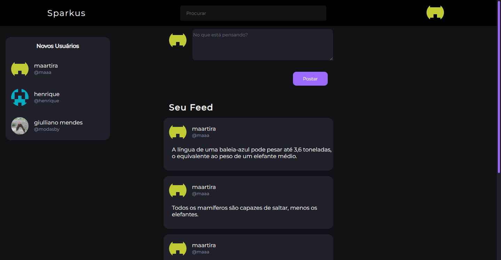
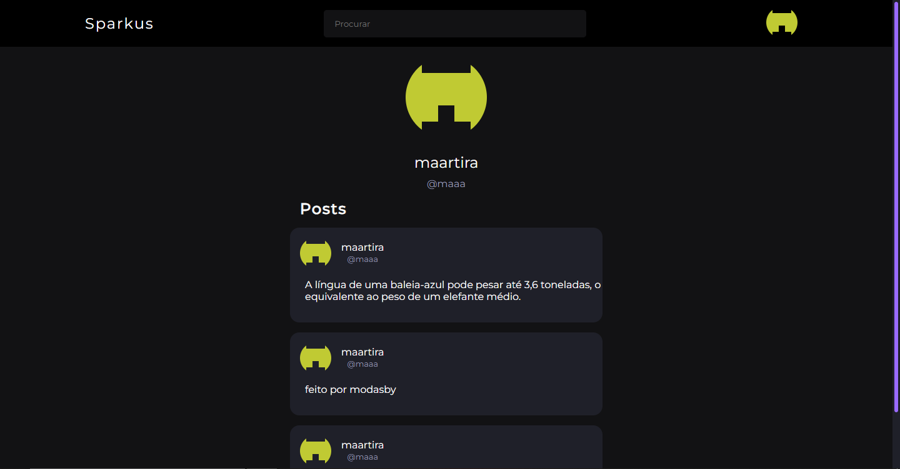

# Sparkus - Rede Social

## Sobre 
Uma rede social onde é possível fazer posts, ver os posts de outras pessoas e visualizar os perfis delas

## Fotos

## Tecnologias

esse projeto foi feito usando react no frontend, e spring boot no [backend](https://github.com/MoDasby/sparkus-backend)